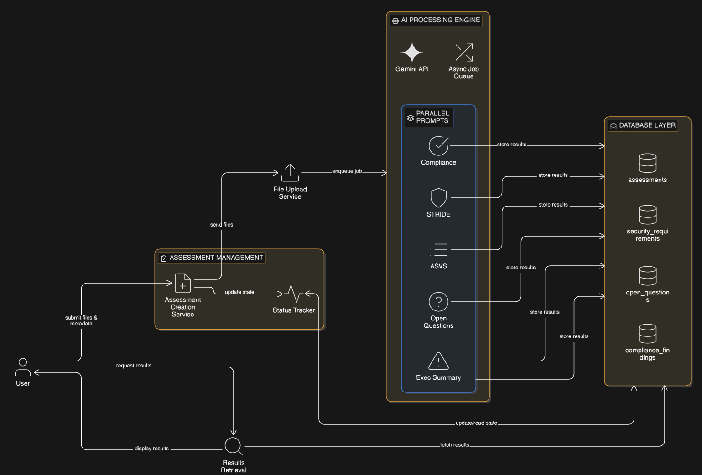

# 🛡️ **Seezo-SDR** — Automated Security Design Review Platform

> ***Intelligent security threat analysis powered by AI. Automatically generate security requirements, compliance mappings, and risk assessments from your architecture diagrams and documentation.***

<div align="center">

[](https://nextjs.org)
[](https://www.typescriptlang.org)
[](https://www.mongodb.com)
[](https://ai.google.dev)
[](LICENSE)
[]()

</div>

---

## 🎯 **What is Seezo-SDR?**

**Seezo** is a next-generation **Security Design Review (SDR)** platform that leverages **Google Gemini AI** to automate the security review process. Instead of manual, time-consuming security assessments, Seezo:

✨ **Analyzes** your architecture diagrams and documentation  
🔍 **Identifies** security threats using threat modeling (STRIDE)  
📋 **Generates** actionable security requirements (ASVS-mapped)  
✅ **Maps** compliance requirements (SOC 2, HIPAA, PCI-DSS)  
❓ **Asks** critical security questions  
📊 **Provides** executive risk summaries  

Perfect for **developers, security architects, and product teams** who need security reviews before shipping code.

---

## 🎥 **Product Demo**

<div align="center">

<video width="920" controls>
    <source src="public/demo/seezo-demo.mp4" type="video/mp4" />
    Your browser does not support the video tag.
</video>

</div>

## 🧩 **High-Level Architecture**



## ⚡ **Key Features**

| 🎨 | **Feature** | **Description** |
|:---:|:---|:---|
| 🏗️ | **Diagram Analysis** | Upload architecture diagrams; AI extracts components, data flows, and trust boundaries |
| 🔐 | **Security Requirements** | Auto-generate ASVS-mapped security requirements with risk levels |
| 🔄 | **Threat Modeling** | STRIDE-based threat identification from your architecture |
| 📋 | **Compliance Mapping** | Automatic mapping to SOC 2, HIPAA, PCI-DSS, ISO 27001 |
| ❓ | **Open Questions** | AI-generated follow-up questions to validate security assumptions |
| 📊 | **Risk Dashboard** | Visual risk posture across projects and assessments |
| 👥 | **Multi-Project Support** | Organize assessments by project with role-based access |
| 🔔 | **Real-time Status** | Track assessment progress from draft to completion |
| 👤 | **Admin User Management** | Full CRUD dashboard with search, stats, and bulk operations |
| 🔗 | **Integration Configuration** | Connect 8+ platforms (Slack, Jira, ServiceNow, Confluence, Google Docs, Notion, Lucidchart, IcePanel) |
| 🔒 | **OTP-Based Auth** | Secure email verification + passwordless login with JWT tokens |

---

## 🏗️ **Tech Stack**

**Frontend:**
- ⚛️ React 19 + Next.js 16 (App Router)
- 🎨 Tailwind CSS v4 + Radix UI (Accessible components)
- 📦 TypeScript (Full type safety)
- 🎯 Lucide Icons + CVA (Styled variants)

**Backend:**
- 🚀 Next.js API Routes
- 📦 MongoDB (Document database)
- 🔐 JWT + OTP Authentication
- 🤖 Google Gemini 2.5 Flash (AI orchestration)

**Infrastructure:**
- 📁 File uploads (Local storage, S3-ready)
- 🔒 HTTP-only cookies (Secure sessions)
- ⚡ Asynchronous AI processing (Non-blocking)

---

## 🚀 **Quick Start**

### **Prerequisites**
- Node.js 18+
- MongoDB instance (local or Atlas)
- Google Gemini API key

### **Installation**

```bash
# 1. Clone the repository
git clone https://github.com/yourusername/seezo-sdr.git
cd seezo-sdr

# 2. Install dependencies
npm install

# 3. Set up environment variables
cp .env.example .env.local
# Edit .env.local with your API keys:
# DATABASE_URL=mongodb://...
# JWT_SECRET=your-secret-key
# GEMINI_API_KEY=your-gemini-api-key

# 4. Run the development server
npm run dev

# 5. Open browser
open http://localhost:3000
```

### **Development Scripts**

```bash
npm run dev     # Start dev server
npm run build   # Build for production
npm start       # Start production server
npm run lint    # Run ESLint
```

---

## 📖 **Usage Workflow**

```
1. Sign up → Verify email with OTP
2. Create project → Organize by team/product
3. Create assessment → Upload architecture diagram + docs
4. AI Analysis → Gemini analyzes and generates insights
5. Review Results → Security requirements, compliance, questions
6. Mark Status → Accept/Mitigate/Not Applicable
7. Export → Generate security reports
```

---

## 🔐 **Authentication & Authorization**

Seezo uses a **secure, OTP-based authentication flow**:

```
Signup:  Name + Email + Company → User created (unverified) → OTP emailed → Verify → Account activated
Login:   Email → Check verified status → Generate OTP → Verify → Create JWT → Set HTTP-only cookie
JWT:     1-hour expiration | Stored in HTTP-only cookie | Verified on every API call

Verification Requirement:
❌ Unverified users: Cannot login (returns 403 Forbidden)
✅ Verified users: Can access dashboard + manage assessments
```

**OTP Security:**
- 6-digit random code (expires in 10 minutes)
- Hashed storage (never plain text in database)
- Single use only (deleted after verification)
- Resend capability with rate limiting

---

## 🧠 **AI Processing Pipeline**

When you create an assessment, Seezo's AI engine:

```
1️⃣  DIAGRAM ANALYSIS
    └─ Extract architecture components, data flows, trust boundaries

2️⃣  THREAT MODELING
    └─ Apply STRIDE framework; identify potential threats

3️⃣  SECURITY REQUIREMENTS
    └─ Generate ASVS-mapped requirements with risk levels

4️⃣  COMPLIANCE MAPPING
    └─ Map to SOC 2, HIPAA, PCI-DSS, ISO 27001

5️⃣  RISK SUMMARY
    └─ Generate executive summary + risk posture
```

**All processing happens asynchronously** — assessment is saved immediately, AI runs in background.

---

## 🔒 **Security Features**

✅ **Server-side authentication** with JWT  
✅ **User data isolation** — projects filtered by owner  
✅ **OTP verification** for account access  
✅ **HTTP-only cookies** for session storage  
✅ **Input validation** on all API routes  
✅ **Type-safe database queries** with ObjectId validation  

---

## 📊 **Database Schema**

Seezo uses MongoDB with these collections:

| Collection | Purpose |
|:---|:---|
| `users` | User accounts + verification status |
| `projects` | Projects (owned by users) |
| `assessments` | Security assessments |
| `security_requirements` | Generated security requirements |
| `compliance_findings` | Compliance mappings |
| `open_questions` | AI-generated questions |
| `otps` | One-time passwords |

---

## 📦 **Dependencies**

See [package.json](package.json) for full list. Key packages:

```json
{
  "@google/genai": "^1.38.0",      // Gemini AI API
  "mongodb": "^7.0.0",              // Database
  "next": "^16.1.4",                // Framework
  "react": "^19.2.3",               // UI
  "tailwindcss": "^4",              // Styling
  "@radix-ui/react-*": "*",         // Components
  "jsonwebtoken": "^9.0.3",         // Auth
  "typescript": "^5"                // Type safety
}
```

---

## 🤝 **Contributing**

Contributions are welcome! Please follow these steps:

1. Fork the repository
2. Create a feature branch (`git checkout -b feature/amazing-feature`)
3. Commit changes (`git commit -m 'Add amazing feature'`)
4. Push to branch (`git push origin feature/amazing-feature`)
5. Open a Pull Request

---

## 📝 **License**

This project is licensed under the **MIT License** — see [LICENSE](LICENSE) file for details.

---

## 👨‍💻 **Authors**

**Charan**  
🔗 [GitHub](https://github.com/charan-s108) | 💼 [LinkedIn](https://linkedin.com/in/charan-s108) | 📧 charansrinivas108@gmail.com

---

<div align="center">

### 🎉 **Built with ❤️ for Security-First Development**


⭐ If you find Seezo helpful, please consider giving it a star!

</div>
